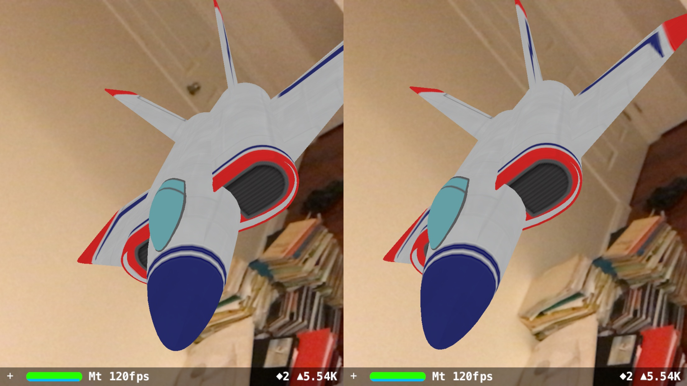

# iOS-Stereoscopic-ARKit-Template
Xcode's 'Augmented Reality App' template, modified to support a basic stereoscopic (two side-by-side camera) view. A few lines of code (and storyboard tweaks) to make your ARKit experiment compatible with cheap mobile VR headsets* .



Language: Swift
Content Technology: SceneKit.

Written in: Xcode 9 beta 2 (9M137d)
Tested on: iPhone 7+ running iOS 11 beta 2 (15A5404i)

## Footnotes

\* Mobile Headset needs to have an opening for the iPhone's camera (i.e. headset supports Mixed Reality or Augmented Reality). You could also use a Google Cardboard with a hole cut out.

Note: The background camera feed will appear as a flat background.

Note: This is experimental code running on beta software that is likely to change. Apple may also provide a function for this in the future (e.g. via SCNHeadMountedDisplayRenderingTechnique, MDLStereoscopicCamera) hinted at by [Steve T-S' finding](https://twitter.com/stroughtonsmith/status/776740802869460992) .

## Steps Taken

### 1. Two ARSceneViews

Put two ARSceneViews next to each other in storyboard.

### 2. Turn on the second ARSceneView (the Right Eye)

Connect the second ARSceneView to the ViewController

```
@IBOutlet weak var sceneView: ARSCNView!

@IBOutlet weak var sceneView2: ARSCNView!
```

Turn on sceneView2 in viewDidLoad()

```
override func viewDidLoad() {
    ...

    sceneView2.scene = scene
    sceneView2.showsStatistics = sceneView.showsStatistics
    sceneView2.isPlaying = true
}
```

### 3. Update RightEye every frame.

Add functions to mirror the ARSceneViews every frame.

```
func renderer(_ renderer: SCNSceneRenderer, updateAtTime time: TimeInterval) {
    DispatchQueue.main.async {
        self.updateFrame()
    }
}

func updateFrame() {
    
    // Clone pointOfView for Second View
    let pointOfView : SCNNode = (sceneView.pointOfView?.clone())!

    // Add calculations for right-eye position ...

    sceneView2.pointOfView = pointOfView
    
}
```

Add calculations for the right-eye positon in updateFrame()

```
    // Determine Adjusted Position for Right Eye
    let orientation : SCNQuaternion = pointOfView.orientation
    let orientationQuaternion : GLKQuaternion = GLKQuaternionMake(orientation.x, orientation.y, orientation.z, orientation.w)
    let eyePos : GLKVector3 = GLKVector3Make(1.0, 0.0, 0.0)
    let rotatedEyePos : GLKVector3 = GLKQuaternionRotateVector3(orientationQuaternion, eyePos)
    let rotatedEyePosSCNV : SCNVector3 = SCNVector3Make(rotatedEyePos.x, rotatedEyePos.y, rotatedEyePos.z)
    
    let mag : Float = 0.066 // This is the value for the distance between two pupils (in metres). The Interpupilary Distance (IPD).
    pointOfView.position.x += rotatedEyePosSCNV.x * mag
    pointOfView.position.y += rotatedEyePosSCNV.y * mag
    pointOfView.position.z += rotatedEyePosSCNV.z * mag
```
